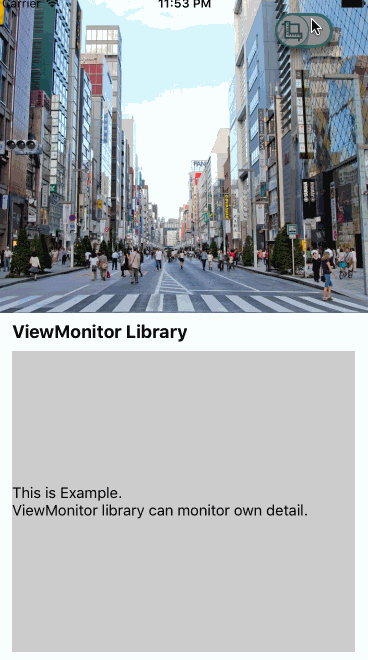

# ViewMonitor

[](https://travis-ci.org/Daisuke Yamashita/ViewMonitor)
[](http://cocoapods.org/pods/ViewMonitor)
[](http://cocoapods.org/pods/ViewMonitor)
[](http://cocoapods.org/pods/ViewMonitor)

## What's ViewMonitor
ViewMonitor can measure View positions with accuracy.
This library is to check design sheet from native app.

behave like this.



## Usage

To run the example project, clone the repo.

## Installation
### cocoaPods
ViewMonitor is available through [CocoaPods](http://cocoapods.org). To install
it, simply add the following line to your Podfile:
```ruby
pod "ViewMonitor"
```
after that, please run 
```ruby
pod install
```

## How to use
First, ```import ViewMonitor```

Execute ```ViewMonitor.start()``` after application started. 
Like this
```
import ViewMonitor

func application(application: UIApplication, didFinishLaunchingWithOptions launchOptions: [NSObject: AnyObject]?) -> Bool {
  ViewMonitor.start()
  return true
}
```
After that, execution button appear.

Please,refer to Example/ViewMonitorExample

## Author
### developer
[Daisuke Yamashita](https://github.com/daisuke0131)
### designer
[Satomi Nogawa](https://github.com/stmngw)

## License
ViewMonitor is available under the MIT license. See the LICENSE file for more info.

## Other
[How to measure UIView position on Native App](http://www.slideshare.net/daisukeyamashita180/18potatotips-yamashita) at potatotips #18
